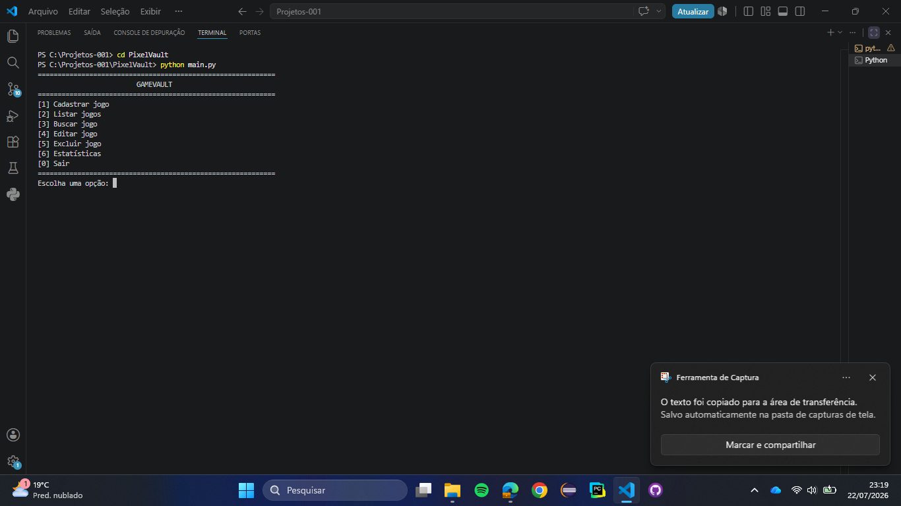
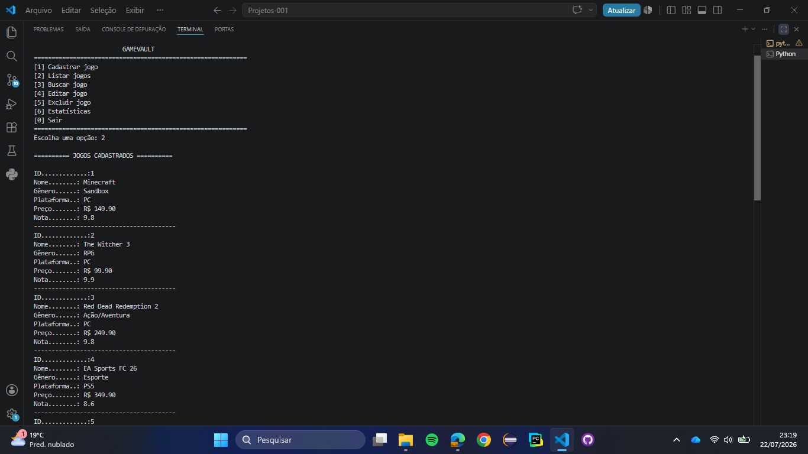
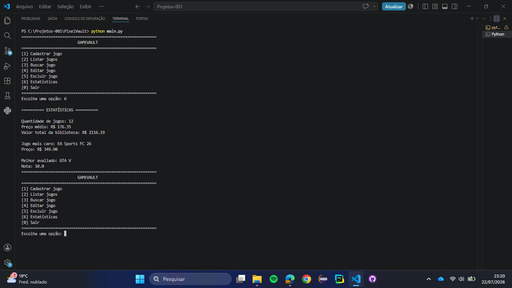

# 🎮 GameVault

O GameVault é um sistema simples de gerenciamento de jogos desenvolvido em Python.

Esse foi o meu primeiro projeto completo utilizando Python. O principal objetivo foi colocar em prática os conceitos que aprendi durante os estudos, como funções, listas, dicionários, modularização e manipulação de arquivos JSON.

## Funcionalidades

* Cadastrar jogos
* Listar jogos
* Buscar jogos pelo nome
* Editar informações de um jogo
* Excluir jogos
* Visualizar estatísticas da biblioteca
* Salvar automaticamente os dados em um arquivo JSON

## Tecnologias utilizadas

* Python
* JSON
* VS Code
* Git

## 📸 Demonstração do projeto

### Menu principal



### Lista de jogos



### Estatísticas



## Estrutura do projeto

```text
PixelVault/
│
├── assets/
├── data/
│   └── jogos.json
├── pedrolib/
├── services/
├── main.py
├── README.md
└── .gitignore
```

## O que aprendi

Durante o desenvolvimento deste projeto pratiquei vários conceitos importantes, entre eles:

* Organização de projetos em módulos
* Criação de funções
* Manipulação de listas e dicionários
* Operações de CRUD (Cadastrar, Listar, Buscar, Editar e Excluir)
* Leitura e gravação de arquivos JSON
* Tratamento básico de erros com `try` e `except`

Foi um projeto que me ajudou bastante a entender como organizar uma aplicação em Python e como dividir o código em diferentes arquivos.

## Como executar

Clone o repositório e execute:

```bash
python main.py
```

## Próximos passos

Pretendo continuar melhorando este projeto adicionando novas funcionalidades e, conforme avanço nos estudos, integrar um banco de dados em vez de utilizar JSON.

## Autor

Pedro Henrique Américo Brandão
